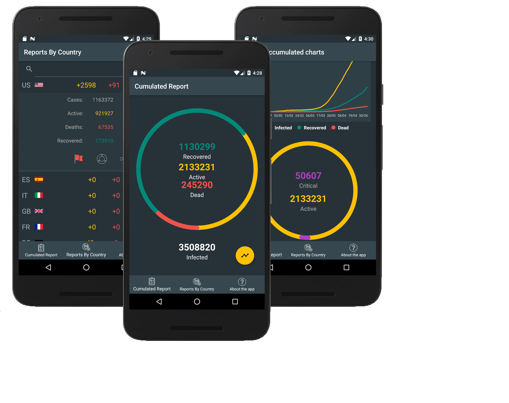

## Android application to track SARS-CoV-2 outbreak   ##

SARS-CoV-2 is a coronavirus causing COVID-19 disease. This application lets user track progress of the pandemic.
Data source used by the application is provided by: https://github.com/NovelCOVID/API

## Credits ##
This app was made with free graphical assets. We would like to thank their authors for sharing their work for free.

<a href="https://www.freepik.com/free-photos-vectors/world">World vector created by freepik - www.freepik.com</a>

Icons made by <a href="https://www.flaticon.com/authors/ultimatearm" title="ultimatearm">ultimatearm</a> from <a href="https://www.flaticon.com/" title="Flaticon"> www.flaticon.com</a>

Icons made by <a href="https://www.flaticon.com/authors/smashicons" title="Smashicons">Smashicons</a> from <a href="https://www.flaticon.com/" title="Flaticon">www.flaticon.com</a>
